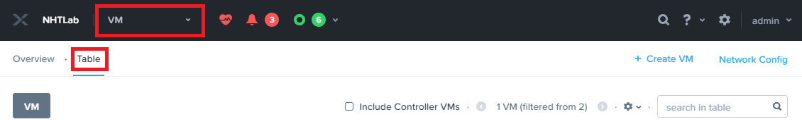
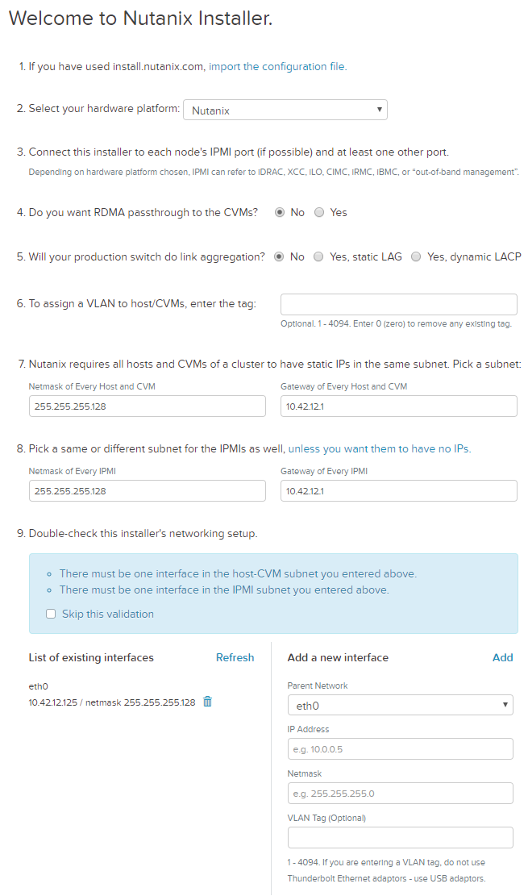
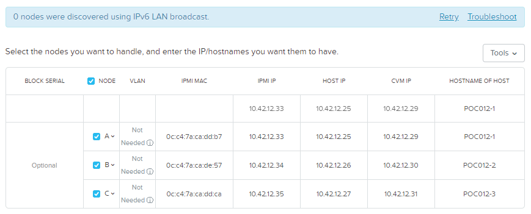
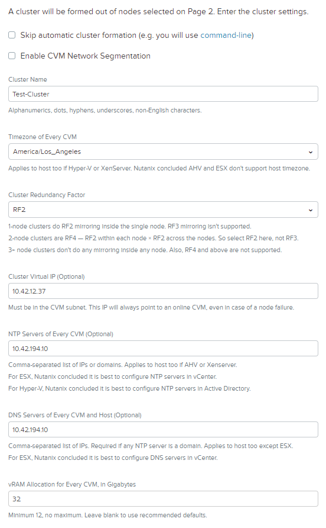
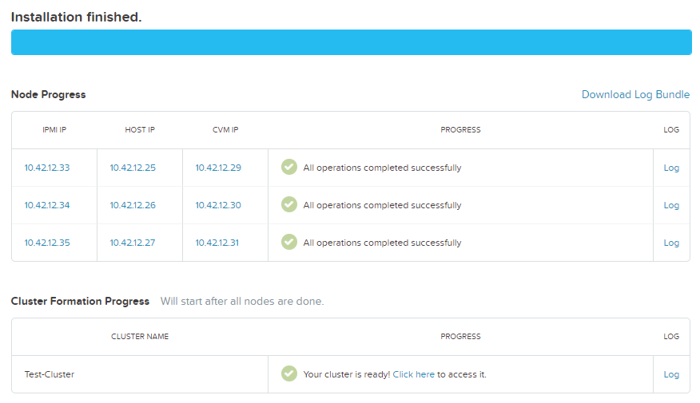

.. role:: html(raw)
   :format: html

.. _groupfoundation_lab:

----------
Foundation
----------

Overview
++++++++

.. note::

  Estimated time to complete: **90 Minutes**

Foundation is used to automate the installation of the hypervisor and Controller VM on one or more nodes. In this exercise you will practice imaging a physical cluster with Foundation. In order to keep the lab self-contained, you will create a single node "cluster" on which you will deploy your Foundation VM. That Foundation instance will be used to image and create a cluster from the remaining 3 nodes in the Block.

Cluster Details
...............

Using the spreadsheet below, locate your **Group Number** and corresponding details for your assigned cluster.

.. raw:: html

   <iframe width="98%" height="600" frameborder="0" scrolling="no" src="https://nutanixinc-my.sharepoint.com/:x:/g/personal/matthew_bator_nutanix_com/EdpnKQfT40pMmMOqhfZEuNEBYhyKzLamWA7bt4SICGqF-A?e=X5snC7&action=embedview&Item='Cluster%20Details'!A1%3AM41&wdHideGridlines=True&wdInConfigurator=True"></iframe>

References and Downloads
........................

The following links are provided for reference and not required to complete the lab exercise.

- `Field Installation Guide <https://portal.nutanix.com/#/page/docs/details?targetId=Field-Installation-Guide-v4-3:Field-Installation-Guide-v4-3>`_ - *Comprehensive Foundation documentation. Refer to Preparing the Installation Environment section for complete steps for local deployment of Foundation VM.*
- `Foundation Release Notes <https://portal.nutanix.com/#/page/docs/details?targetId=Field-Installation-Guide-Rls-Notes-v4-3:Field-Installation-Guide-Rls-Notes-v4-3>`_ - *Fixes, known issues, enhancements, and upgrade information.*
- `NX Hardware System Specifications <https://portal.nutanix.com/#/page/docs/list?type=hardware>`_ - *Helpful for determining LAN/IPMI/Shared ports for different hardware platforms.*
- `Foundation binaries and related files <https://portal.nutanix.com/#/page/foundation>`_ - *Downloads for baremetal Foundation, CVM Foundation, and ISO whitelist. Use Foundation_VM-<version>.tar download for local Foundation VM deployment.*
- `KB2430 <https://portal.nutanix.com/#/page/kbs/details?targetId=kA032000000TT1HCAW>`_ - *Internal Only KB detailing how to download old versions of AOS/AHV that are no longer available on Nutanix Portal.*
- `vSphere Administration Guide for Acropolis <https://portal.nutanix.com/#/page/docs/details?targetId=vSphere-Admin6-AOS-v56:vSphere-Admin6-AOS-v56>`_ - *Includes post-install steps for configuring HA/DRS on vSphere.*

Cabling Your Hardware
+++++++++++++++++++++

.. note::

  The following lab will be performed with a cluster in the Nutanix Hosted POC environment. The information on cabling below is for reference when performing a physical, baremetal Nutanix installation.

Foundation requires connectivity to **both** the standard network interface of a node and the Baseboard Management Controller (BMC) network interface. The BMC, called **IPMI** on Nutanix NX nodes, is a dedicated system present in every enterprise server platform used for out of band management. Other supported platforms use different names for IPMI, such as iDRAC on Dell, IMM on Lenovo, and iLO on HPE.

Referring to the example diagram below, there are two options for cabling Nutanix nodes prior to imaging with Foundation:

- Using two cables per node, one connected to either onboard LAN port and one connected to the dedicated IPMI port.
- Using one cable per node, connected to the **Shared IPMI** port. With only the **Shared** port connected, it is capable of intelligently forwarding traffic to either the IPMI or LAN interface, allowing Foundation to communicate with both interfaces simultaneously.

.. figure:: images/back-panel.png

.. note::

  During node power off/on the Shared port on certain platforms may switch between 100Mb and 1Gb speeds, which can cause issues if your switch cannot auto-negotiate to the proper speed.

  Additionally, for nodes such as the NX-3175 which only have 10Gb SFP+ onboard NICs, the 1Gb transceiver used to connect to your flat switch requires electrical power. That power is only available when the node is powered on, making it critical to use two cables per node in this situation.

  Overall, if there are sufficient cables and ports available, using two cables per node is preferred.

Both the nodes and the host used to run the Foundation VM should be connected to the same flat switch. If imaging on a customer switch, ensure that any ports used are configured as **Access** or **Untagged**, or that a **Native** VLAN has been configured.

Refer to the appropriate `manufacturer's hardware documentation <https://portal.nutanix.com/#/page/docs/list?type=hardware>`_ to determine the locations of the **IPMI** and **Shared** ports.

Staging Your Environment
++++++++++++++++++++++++

A Hosted POC reservation provides a fully imaged cluster consisting of 4 nodes. To shorten this exercise, your environment has been staged as follows:

- A three node cluster using Nodes A, B, and C has been created
- A single node LAB "cluster" using Node D has been created
- The Foundation VM disk image has been staged in the Node D cluster Image Service

During the remainder of the exercise, your team will:

- Install the Foundation VM on Node D
- Use Foundation to image Nodes A, B, and C and create a 3 node cluster

.. note::

   For the complete steps used to stage the environment, refer to the :ref:`diyfoundation_lab` Practice Lab.

Installing Foundation
+++++++++++++++++++++

Open \https://*<CVM IP of NODE D>*:9440 (*The correct IP should end in .32*) in your browser and log in with the following credentials:

- **Username** - admin
- **Password** - techX2020!

Open **Prism > VM > Table** and click **Network Config**.

Before creating the VM, we must first create a virtual network to assign to the Foundation VM. The network will use the Native VLAN assigned to the physical uplinks for all 4 nodes in the block.

Click **Virtual Networks > Create Network**.

Fill out the following fields and click **Save**:

- **Name** - Primary
- **VLAN ID** - 0

.. note::

   Using VLAN 0 (referred to as an **Untagged** or **Access** network) is equivalent to running a Foundation VM on your laptop, with a bridged network connection to your physical Ethernet adapter, plugged into a flat, unmanaged switch connected to your Nutanix block being imaged - putting all devices on the same Layer 2 network.

Click **Create Network**. Using the `Cluster Details`_ spreadsheet, fill out the following fields and click **Save**:

- **Name** - Secondary
- **VLAN ID** - *<Secondary VLAN ID>*

.. figure:: images/00.png

.. note::

   The **Secondary** network will be used later in the :ref:`groupxray_lab` lab.

Click the **X** icon in the top, right-hand corner to close **Network Configuration**.

In **Prism > VM > Table** and click **+ Create VM**.

Fill out the following fields:

- **Name** - Foundation
- **Description** - *Optional*
- **Timezone** - *Leave Default*
- **vCPU(s)** - 2
- **Number of Cores per vCPU** - 1
- **Memory** - 4 GiB
- Select **+ Add New Disk**

  - **Operation** - Clone from Image Service
  - **Image** - Foundation.qcow2
  - Select **Add**
- Select **Add New NIC**

  - **VLAN Name** - Primary
  - Select **Add**

Click **Save**.

Select your **Foundation** VM and click **Power on**.

.. note::

  At the time of writing, Foundation 4.5.2 is the latest available version.

  When running Foundation in the field, always be sure to use the `latest version of Foundation <https://portal.nutanix.com/#/page/foundation>`_, unless otherwise directed by support.

Once the VM has started, click **Launch Console**.

Once the VM has finished booting, click **nutanix**. Enter the default password (**nutanix/4u**) and click **Log In**.

.. figure:: images/1.png

Double-click **set_foundation_ip_address > Run in Terminal**.

Press **Return** to select **Device configuration**.

.. figure:: images/2.png

Press **Return** to select **eth0**.

.. figure:: images/3.png

.. note:: Use the arrow keys to navigate between menu items.

Using the `Cluster Details`_ spreadsheet, replace the octet(s) that correspond to your HPOC network (*DO NOT USE THE VALUES FROM THE SCREENSHOTS BELOW!*), fill out the following fields:

- Un-select **Use DHCP** by pressing **Space**
- **Static IP** - *<Foundation VM IP>*
- **Netmask** - 255.255.255.128
- **Gateway** - *<Gateway IP>*

.. figure:: images/4.png

Select **OK** and press **Return**.

.. note::

  The Foundation VM IP address should be in the same subnet as the target IP range for the CVM/hypervisor of the nodes being imaged. As Foundation is typically performed on a flat switch and not on a production network, the Foundation IP can generally be any IP in the target subnet that doesn't conflict with the CVM/hypervisor/IPMI IP of a targeted node.

Select **Save** and press **Return**.

.. figure:: images/5.png

Select **Save & Quit** and press **Return**.

.. figure:: images/6.png

This will restart the **eth0** interface, allowing you to contact the Foundation VM using the configured static IP.

Running Foundation
++++++++++++++++++

From your local browser, open \http://*<Foundation VM IP>*:8000/gui/index.html to access the Foundation web interface.

If prompted to upgrade, click **Remind Me Later**.

.. note::

  For physical deployments ensure you are using the latest version of Foundation. Any available upgrades are skipped for the lab due to time constraints.

On the **Start** page, fill out the following fields:

- **Select your hardware platform** - Nutanix
- **Will your production switch do link aggregation?** - No
- **Netmask of Every Host and CVM** - 255.255.255.128
- **Gateway of Every Host and CVM** - 10.42.\ *XYZ*\ .1
- **Netmask of Every IPMI** - 255.255.255.128
- **Gateway of Every IPMI** - 10.42.\ *XYZ*\ .1

.. note::

   Specifying a host/CVM VLAN will allow you to tag the CVM/Hypervisor VLAN as part of the installation, saving additional steps post-Foundation for readying the cluster to cutover to a production network. It is common for the Ethernet uplinks for each node to be connected to trunked ports tagged for several VLANs (CVM/Hypervisor network, user VM networks, backup network, etc.).

.. note::

  Foundation node/cluster settings can optionally be pre-configured using https://install.nutanix.com and imported from the **Start** page. This will not be done as part of the lab.

.. note::

  When imaging a cluster with Foundation, the CVMs and hypervisor management IP addresses must be in the same subnet. IPMI IP addresses can be in the same, or different, subnet. If IPMI will not be in the same subnet as CVM/hypervisor, Foundation can use different IP addresses for IPMI and CVM/hypervisor while on a flat, L2 network by clicking **Add a new interface**.

Click **Next**.

Click **Click here** to manually specify the MAC address of your assigned nodes.

.. note::

  Foundation will automatically discover any hosts in the same IPv6 Link Local broadcast domain that is not already part of a cluster.

  .. figure:: images/7b.png

  When transferring POC assets in the field, it's not uncommon to receive a cluster that wasn't properly destroyed at the conclusion of the previous POC. In this lab, the nodes are already part of existing clusters and will not be discovered.

Fill out the following fields and click **Add Nodes**:

- **Number of Blocks** - 1
- **Nodes per Block** - 3
- Select **I will provide the IPMI MACs**

.. figure:: images/8.png

Using the `Cluster Details`_ spreadsheet, fill out the following fields for **Nodes A, B, and C ONLY** and click **Next**:

.. note::

  Use **Tools > Range Autofill** to quickly specify Node IPs. Specify the first IP in the field at the top of the table to provide enumerated values for the entire column.

- **Node** - *<Node Position>*
- **IPMI MAC** - *<IPMI MAC>*
- **IPMI IP** - *<IPMI IP>*
- **Host IP** - *<Hypervisor IP>*
- **CVM IP** - *<CVM IP>*
- **Hypervisor Hostname** - *<Hypervisor Hostname>*

.. note::

  In addition to the IPMI MAC address labels on the back of each node. Watchtower can be used to collect the IPMI MAC addresses of any NX appliance: *\http://watchtower.corp.nutanix.com/factoryData/<Block Serial>/*

  Watchtower requires VPN connection.

Using the `Cluster Details`_ spreadsheet, replace the octet(s) that correspond to your HPOC network, fill out the following fields and click **Next**:

- **Cluster Name** - Test-Cluster

  *Cluster Name is a "friendly" name that can be easily changed post-installation. It is common to create a DNS A record of the Cluster Name that points to the Cluster Virtual IP.*
- **Timezone of Every CVM** - America/Los_Angeles
- **Cluster Redundancy Factor** - RF2

  *Redundancy Factor 2 requires a minimum of 3 nodes, Redundancy Factor 3 requires a minimum of 5 nodes. Cluster creation during Foundation will fail if the appropriate minimum is not met.*
- **Cluster Virtual IP** - 10.\ *ABC*\ .\ *XYZ*\ .37

  *Cluster Virtual IP needs to be within the same subnet as the CVM/hypervisor.*
- **NTP Servers of Every CVM** - 10.42.194.10
- **DNS Servers of Every CVM and Host** - 10.42.194.10

  *DNS and NTP servers should be captured as part of install planning with the customer.*

- **vRAM Allocation for Every CVM, in Gigabytes** - 32

  *Refer to AOS Release Notes > Controller VM Memory Configurations for guidance on CVM Memory Allocation.*

Next, you will need to download an AOS package on your Foundation VM.

:html:`<strong>Do not start downloading an AOS package from the Portal to then upload to your Foundation VM. While this is what you would do for a Foundation VM running locally on your laptop, downloading and re-uploading a ~4.5GB package over the WAN/VPN will take HOURS. Instead, follow the instructions below to download the AOS package from WITHIN your Foundation VM, accessing a file share on the same LAN as your HPOC cluster.</strong>`

Open the Foundation VM console from within Prism Element.

In Firefox, open http://10.42.194.11/workshop_staging/nht/ and select an available AOS package. Save the file in the **~/foundation/nos** directory.

.. figure:: images/12.png

Once the download completes (~60 seconds), return to the Foundation web interface in your local browser.

Click **Manage AOS Files > Refresh** and note your *nutanix_installer_package-release-\*.tar.gz* package now appears.

.. figure:: images/16.png

Close the dialog box and select your AOS package from the dropdown menu.

Click **Next** to select your desired hypervisor image.

Fill out the following fields and click **Next**:

- **Select a hypervisor installer** - AHV, AHV installer bundled inside the AOS installer

.. figure:: images/17.png

.. note::

  Every AOS release contains a version of AHV bundled with that release.

.. note::

  When selecting an alternate hypervisor (ESXi, Hyper-V) you can use this page to upload installation ISO files and, if necessary, modified whitelists.

Select **Fill with Nutanix defaults** from the **Tools** dropdown menu to populate the credentials used to access IPMI on each node.

.. figure:: images/18.png

.. note:: When performing a baremetal Foundation in the field, ensure your laptop will not go to sleep due to inactivity.

Click **Start > Proceed** and continue to monitor Foundation progress through the Foundation web console. Click the **Log** link to view the realtime log output from your node.

.. figure:: images/19.png

Foundation will leverage IPMI (or the Out of Band Management standard for the given hardware platform, e.g. iDRAC, iLO, CIMC, etc.) to boot each node to a virtual CD image called Phoenix. The Phoenix image contains what are called "Layout Modules." Layout Modules provide critical hardware information to the installer, allowing Nutanix to support a wide range of hardware configurations (NX, Dell, Lenovo, IBM, Cisco, HPE, Klas, Crystal, etc.).

Phoenix will download the AOS and hypervisor binaries from the Foundation VM. Once Phoenix is booted on each node, Phoenix communicates with Foundation via the node's LAN connection. IPMI is only used for mounting the virtual CD image.

Phoenix will then perform an automated installation of the hypervisor (including any packaged drivers) to the appropriate boot media (SATADOM, SD Card, M.2 SSD) and writes the CVM filesystem to a dedicated partition on the first SSD in the system (NOT on the hypervisor boot media).

After these tasks are completed, the node reboots to the newly installed hypervisor. The hypervisor iterates through the SSDs to find out which SSD has the CVM, and then boots the CVM. Firstboot scripts are run to prepare the hypervisor and CVM on the node, including setting IP information.

When all CVMs are ready, Foundation initiates the cluster creation process.

**Close the Foundation VM Console.**

Open \https://*<Cluster Virtual IP>*:9440 in your local browser and log in with the following credentials:

- **Username** - admin
- **Password** - Nutanix/4u

.. figure:: images/21.png

When prompted, change the default password to **techX2020!**

Accept the EULA, and enable Pulse.

Post-Foundation Network Configuration
+++++++++++++++++++++++++++++++++++++

.. note::

  The steps below are provided for **informational purposes only**. The HPOC environment uses a Native VLAN for the CVM/hypervisor and changes are not required. **Explicitly setting CVM/hypervisor VLAN in the HPOC environment will result in a loss of connectivity between nodes.**

By default, the hypervisor management interface and CVM are both assigned to VLAN 0, often referred to as an **Untagged** or **Access** configuration.

In many environments, the CVM/hypervisor VLAN may not be the Native VLAN assigned to the physical switchports to which each Nutanix node will be connected. In this case, it is important to assign the proper VLAN to the CVM and hypervisor for each host before the nodes will be able to communicate on the customer network.

Using a crashcart, or SSH while the nodes are still connected to a flat switch, assign the CVM VLAN followed by the hypervisor VLAN for each node:

AHV
...

Refer to the `AHV Administration Guide <https://portal.nutanix.com/#/page/docs/details?targetId=AHV-Admin-Guide-v56:ahv-acr-nw-segmentation-c.html>`_ for steps on configuring CVM and host VLAN.

ESXi
....

Coming soon!

Hyper-V
.......

Coming soon!
